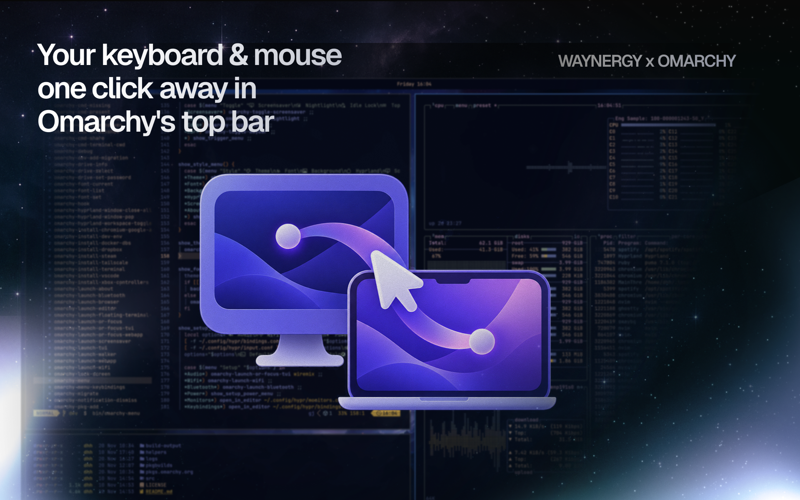
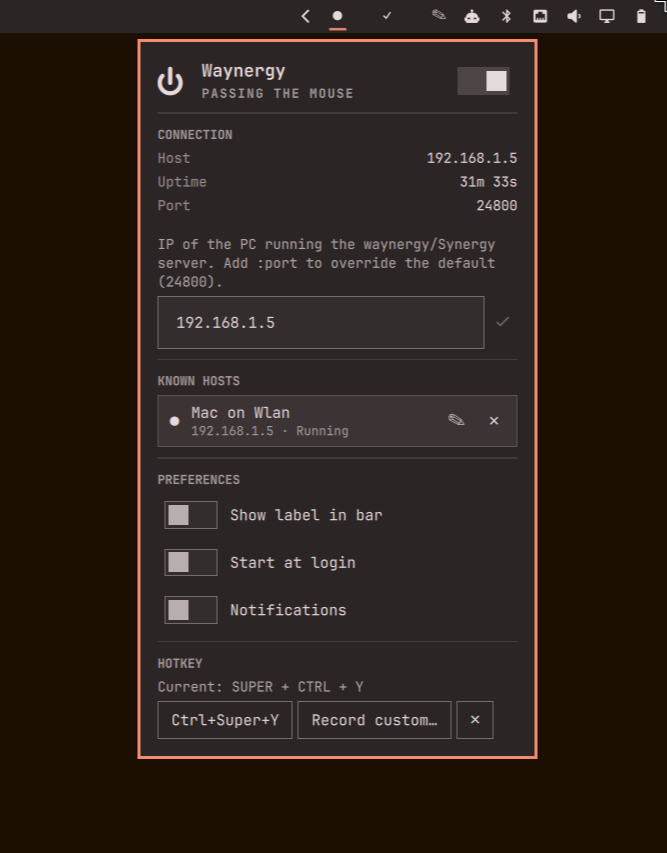

<div align="center">


# Waynergy for Omarchy

**A one-click [waynergy](https://github.com/r-c-f/waynergy) start/stop bar widget for [Omarchy](https://omarchy.org/).**

[](LICENSE)
[](manifest.json)
[](https://omarchy.org/)
[](https://github.com/Aryan-Techie/omarchy-waynergy-plugin/actions/workflows/validate.yml)
[](CONTRIBUTING.md)

*Part of the [AROICE](https://aroice.in) family of tools.*

</div>



Right-click the bar pill to start waynergy; right-click again to kill it.
Left-click opens a small panel with the status, a power toggle, connection
details, a field to change the host (and port, if it's non-default), and a
switch to hide the "Waynergy" text next to the dot — handy when the other
PC's IP changes and you don't want to touch a terminal. It also actually
checks the connection is alive, not just that the process is running, and
tells you when either one drops.

## Contents

- [Who this is for](#who-this-is-for)
- [Features](#features)
- [Requirements](#requirements)
- [Install](#install)
- [Usage](#usage)
  - [Keyboard shortcut](#keyboard-shortcut)
  - [Keyboard navigation inside the panel](#keyboard-navigation-inside-the-panel)
- [How it works](#how-it-works)
- [State files](#state-files)
- [Uninstalling](#uninstalling)
- [Contributing](#contributing)
- [Getting help](#getting-help)
- [Changelog](#changelog)
- [License](#license)
- [Author](#author)

## Who this is for

You use [waynergy](https://github.com/r-c-f/waynergy) (a Wayland-native
[Synergy](https://symless.com/synergy)-compatible client) to share one
keyboard and mouse across two PCs, and you're tired of opening a terminal
every time you want to connect, disconnect, or the other machine's IP
changes (DHCP renewal, switching networks, a fresh install). This plugin
puts start, stop, and the IP field one click away in your Omarchy bar
instead.

If you don't already run a waynergy/Synergy **server** on another machine,
this plugin has nothing to connect to — it's the client-side control only.

## Features

- Bar pill shows a filled dot (`●`) when running, a hollow one (`○`) when
  stopped, next to an optional "Waynergy" label — polled every 5s so it
  stays accurate even if waynergy exits on its own.
- **Right click** — toggle: starts `waynergy -c <host> -p <port> -E` if it's
  not running, kills it (`pkill -x waynergy`) if it is. No panel opens.
- **Left click** — opens a panel with:
  - A power toggle in the header, next to a status line that rotates
    through a few silly phrases while actually connected ("Sharing
    keystrokes", "Herding cursors", ...) — same idiom as the built-in
    Wi-Fi and Bluetooth panels — and drops to a plain word (Stopped, Not
    responding, Starting…) whenever something needs your attention instead.
  - A status pill that actually tells you what's wrong instead of staying
    silent: not installed, a start attempt that died immediately, the
    process running but the host not answering, or it stopping on its own
    after running fine for a while.
  - A connection-details grid (Host, Port, live Uptime) — click the host to
    copy it.
  - A **real reachability check**, not just "is the process alive" — a TCP
    probe to host:port every poll while running, so a dropped connection
    shows up even though `waynergy` itself is still sitting there running.
  - A text field to change the host, saved with the checkmark button next
    to it. Accepts a bare IP (port stays the default `24800`) or `ip:port`
    to target something else.
  - **Known Hosts** — your last 5 saved host:port targets as one-click rows,
    so switching between two PCs doesn't mean retyping anything. Tap one to
    make it active (an already-running session keeps running against the
    old target until you restart it). Give one a name (pencil icon, or
    press **N** with it highlighted) so it reads "Home Mac" instead of a
    raw address; forget one with the small ✕.
  - **Preferences**: show/hide the "Waynergy" label in the bar, start
    waynergy automatically when the bar starts, and mute the desktop
    notifications below if you'd rather not get them.
  - A keyboard shortcut recorder — set once, works from anywhere.
- **Middle click** — force a status refresh.
- **Desktop notifications** (can be muted from Preferences) when waynergy
  stops on its own after running fine, or when it's running but the host
  stops answering — you don't have to be looking at the bar to find out.
- **Auto-start on login** (off by default) — waynergy comes back on its own
  after a reboot, without needing to know whether a previous session
  already survived the reload first (it checks before starting a second
  one).
- **Optional global keyboard shortcut** (`Ctrl+Super+Y` by default, or record
  your own) to open the panel without touching the mouse.
- **Fully keyboard-navigable panel** — Up/Down between every control, Space
  or Enter to activate whatever's highlighted, Escape to back out, **R** to
  refresh and **S** to toggle from anywhere.
- No config file editing required — settings live in a small local JSON
  file, edited entirely from the panel.



## Requirements

- **Omarchy**, obviously — this is a Quickshell bar plugin, not a
  standalone app.
- The **[`waynergy`](https://github.com/r-c-f/waynergy) binary**, installed
  and reachable on `PATH` **for your graphical session** — not just your
  interactive shell. Quickshell launches it directly (no login shell
  sourced), so if it's installed somewhere only your `~/.bashrc`/`~/.zshrc`
  adds to `PATH` (e.g. `~/.local/bin`), also export that same directory in
  your Hyprland/systemd user session (e.g. `~/.config/hypr/*.conf` or
  `~/.config/environment.d/`), or install it to `/usr/local/bin` /
  `/usr/bin` instead. The panel's status pill will tell you plainly if
  waynergy can't be found at all.
- A **waynergy/Synergy server already running on the other PC**, reachable
  on TCP port `24800` by default (configurable per host — see Usage). This
  plugin only drives the client side.
- **Network reachability** between this machine and that host:port — same
  LAN, VPN, Tailscale, whatever gets you there. If the process dies right
  after starting, or the panel says it's running but the host isn't
  responding, that's usually this.

## Install

```
omarchy plugin add https://github.com/Aryan-Techie/omarchy-waynergy-plugin.git --enable
```

Or, to develop/inspect it locally first:

```
omarchy plugin clone io.github.aryan-techie.waynergy --edit
```

(swap in this repo's contents, or just copy this folder to
`~/.config/omarchy/plugins/io.github.aryan-techie.waynergy/` directly and
run `omarchy-shell shell rescanPlugins` if it doesn't pick up right away).

## Usage

| Action | Effect |
|---|---|
| Right click | Start waynergy if stopped, kill it if running |
| Left click | Open the panel (status + power toggle + connection details + host field + Known Hosts + label switch + keyboard shortcut) |
| Middle click | Refresh the running-state check immediately |

### Setting a custom port

The host field takes a bare IP (`192.168.1.5`) or `ip:port`
(`192.168.1.5:9999`). Leave the port off and it defaults to `24800`. Known
Hosts remembers whichever form you saved, so a non-default port round-trips
correctly when you switch back to that entry later.

### Keyboard shortcut

No shortcut is set by default — open the panel once (left-click the bar
pill) and use the **Keyboard shortcut** section at the bottom:

- **Ctrl+Super+Y** — applies that combo immediately.
- **Record custom…** — press it into the box (needs at least one modifier:
  Super/Ctrl/Alt/Shift), then **Apply**. **Esc** cancels the recording.
- **Remove** — clears whatever shortcut is currently set.

Applying writes a line to `~/.config/hypr/bindings.lua` (backed up first as
`bindings.lua.bak.<timestamp>`) and reloads Hyprland. If the reload reports
a config error, the backup is restored automatically and nothing changes.

### Keyboard navigation inside the panel

Once the panel is open:

- **Up / Down** (or **j** / **k**) — move the highlight between every
  control: the power toggle, the IP field, the Save button, any Known
  Hosts rows, the label switch, and the keyboard-shortcut buttons.
- **Space** or **Enter** — activate whatever's highlighted: flips a toggle,
  focuses the IP field for typing, or clicks a button.
- **R** — refresh the running-state check immediately, from anywhere in
  the panel (doesn't need the highlight to be on anything in particular).
- **S** — toggle waynergy on/off, same as **R** works from anywhere.
- **N** — rename whichever Known Hosts row is currently highlighted.
- **Escape** — while actually typing in the IP field, the first Escape just
  exits typing and returns to the highlight (doesn't close the panel); a
  second Escape (or one from anywhere else) closes the panel.

## How it works

- **Start:** `waynergy -c <host> -p <port> -E`, launched through a detached
  bash wrapper (not a tracked process, so it survives plugin reloads and
  isn't tied to the bar widget's lifetime) that backgrounds it and records
  its real PID to `<state dir>/waynergy.pid`. Port defaults to `24800`; the
  `-E` flag is always passed.
- **Stop/status target that specific PID**, not just "whatever's named
  waynergy" — each check confirms `/proc/<pid>/comm` is still literally
  `waynergy` before trusting it, so a stale or unrelated process can't
  eat a signal meant for the instance this plugin actually started. Falls
  back to `pgrep -x waynergy` / `pkill -x waynergy` only right after a
  plugin/shell reload, when the tracked PID hasn't been read back yet —
  and self-heals to a precise PID again on the next poll if that fallback
  finds exactly one match.
- **Reachability:** a plain-bash TCP probe (`timeout 2 bash -c 'echo >
  /dev/tcp/<host>/<port>'`, no `nc`/extra dependency needed) run right
  after each poll that finds the process alive — this is what catches
  "running, but not actually talking to anything," which process-liveness
  alone can't.
- **Installed check:** `which waynergy`, same pattern the built-in
  Tailscale plugin uses, checked on open and on every status poll.
- **Auto-recovery on disconnect:** if the reachability probe fails and
  stays failed for 5 seconds (not acted on immediately — a single blip
  isn't worth it), the plugin stops and restarts waynergy itself, up to 3
  attempts per outage. This is also what clears a **stuck key** — if the
  connection drops mid-keypress, the last key can stay "held" until
  something closes waynergy's virtual input device, which a clean
  stop+restart does (the same reason touching your desktop's own physical
  mouse/keyboard clears it: a fresh input event supersedes the stuck one).
  Not a guaranteed fix — this plugin can't see waynergy's internals — but
  it's the most direct lever available from outside the process.
- **Notifications:** `omarchy-notification-send` (critical urgency) fires
  when waynergy stops on its own after running fine, when a reachability
  probe first fails while it's still running, and when an auto-recovery
  restart actually runs — not repeated on every poll after the first, so
  it doesn't spam you.
- **Keyboard shortcut:** a line appended to `~/.config/hypr/bindings.lua`
  calling `omarchy-shell shell toggle io.github.aryan-techie.waynergy`,
  applied via a backup-first, auto-rollback-on-error script (same mechanism
  the todoist plugin uses for its own shortcut).

## State files

The host IP, port, preferences (label visibility, auto-start, notifications), keyboard
shortcut, and the last 5 saved Known Hosts entries are stored at:

```
~/.local/state/omarchy/io.github.aryan-techie.waynergy/settings.json
```

It's `{ "ip": "...", "port": 24800, "showLabel": true, "keybind": "...", "autoStart": false, "notificationsEnabled": true, "recentIps": [{ "host": "...", "name": "..." }] }`
— each Known Hosts entry is `{host, name}`, `name` empty unless you've set one. Older saved
lists (a plain array of host strings, from before naming existed) load and upgrade
automatically the first time this version runs.
The only other file this plugin writes is
`~/.local/state/omarchy/io.github.aryan-techie.waynergy/waynergy.pid` — the PID of
whichever waynergy instance is currently running, written right after start and used to
target stop/status precisely (see How it works) — plus the one
`~/.config/hypr/bindings.lua` line described above. The only things this
plugin sends anywhere are: the reachability probe (a bare TCP connect
attempt to your own configured host:port, no data sent), and the
`omarchy-notification-send` calls that show local desktop notifications —
the host/port themselves are only ever handed to `waynergy` as `-c`/`-p`
arguments, never shell-interpolated.

## Uninstalling

```
omarchy plugin remove io.github.aryan-techie.waynergy
```

This removes the plugin and its bar entry. Delete the state directory
above too if you want the saved IP gone as well.

## Contributing

See [CONTRIBUTING.md](CONTRIBUTING.md) — project layout, the conventions
worth knowing before you dig in, and how to test a change locally.

## Getting help

Open an issue with the plugin version (`manifest.json`'s `version`
field), what you expected vs. what happened, and `qs log -p
"$OMARCHY_PATH/shell" --tail 100` output if it's a crash or a silent
failure.

## Changelog

See [CHANGELOG.md](CHANGELOG.md).

## License

MIT — see [LICENSE](LICENSE).

## Author

**Aryan Techie** ([Aryan Jangra](https://aryan.aroice.in))

- 🌐 Website: [aryan.aroice.in](https://aryan.aroice.in)
- 📧 Email: [aryan@aroice.in](mailto:aryan@aroice.in)
- 🐙 GitHub: [@Aryan-Techie](https://github.com/Aryan-Techie)
- 🏢 Organization: [AROICE](https://aroice.in)

---

<div align="center">

**Made with ❤️ by [AROICE](https://github.com/AROICE-HQ)**

*Clear tools for a clear mind.*

</div>
